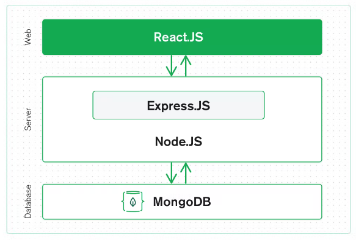

MERN Stack is a JavaScript Stack used for faster and easier deployment of full-stack web-applications. It comprises of 4 technologies: MongoDB, Express, React and Node.js, and has a 3-tier architechture.

The top tier of MERN is React, a JavaScript library used for building user interfaces. The next level down is the Express server-side framework, which supports many middlewares, making it simpler and easier to write the back-end code. Node.js, outside Express, provides a JavaScript Environment. The bottom layer is MongDB, a NoSQL database where each record is a document consist of key-value pairs similar to JSON Objects.

